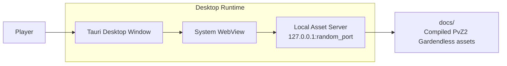
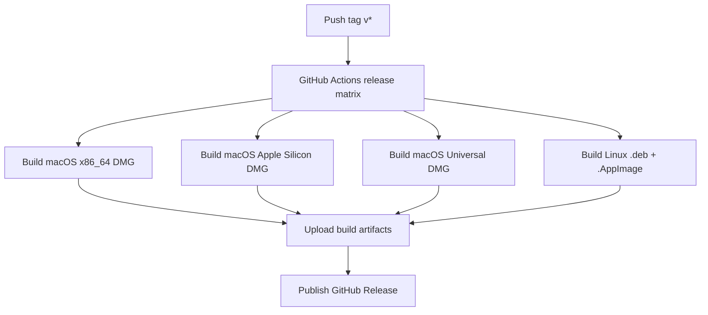

<div align="center">


# PvZ2 Gardendless Tauri

A native desktop wrapper for **PvZ2 Gardendless**, packaged with **Tauri 2** for macOS and Linux.

[Releases](https://github.com/Ic0u/pvge_tauri/releases) · [Release Workflow](https://github.com/Ic0u/pvge_tauri/actions/workflows/release.yml) · [Upstream Project](https://github.com/Gzh0821/pvzg_site)

</div>

## Introduction

`pvge_tauri` distributes PvZ2 Gardendless as a desktop application. The compiled game build lives in `docs/`, while the Tauri app starts a local-only asset server, opens a native desktop window, and renders the game through the system WebView.

This repository is focused on **desktop release artifacts**. It does not deploy a website. GitHub Actions builds installable packages and uploads them directly to GitHub Releases.

## Core Features

- Native desktop application for macOS and Linux using Tauri 2.
- No Docker container required to play on Linux or macOS.
- Local asset server bound to `127.0.0.1` with a random free port.
- Bundled `docs/` game assets inside release builds.
- macOS release matrix for Intel, Apple Silicon, and Universal DMG builds.
- Linux release packages as `.deb` and `.AppImage`.
- Fullscreen shortcuts through `F4` and `F11`.
- First-launch desktop notifications with version and changelog notes.
- Static file serving with basic path traversal protection.
- GitHub Actions release workflow for repeatable desktop packaging.

## Release Assets

Each version tag matching `v*` builds desktop packages and publishes them to GitHub Releases.

| Platform | File | Purpose |
| --- | --- | --- |
| macOS Intel | `PvZ2-Gardendless-macOS-x86_64.dmg` | Intel Macs |
| macOS Apple Silicon | `PvZ2-Gardendless-macOS-Apple-Silicon.dmg` | M1/M2/M3/M4 Macs |
| macOS Universal | `PvZ2-Gardendless-macOS-Universal.dmg` | Intel and Apple Silicon Macs |
| Linux x86_64 | `PvZ2-Gardendless-Linux-x86_64.deb` | Debian/Ubuntu package |
| Linux x86_64 | `PvZ2-Gardendless-Linux-x86_64.AppImage` | Portable Linux app |

> macOS builds are currently unsigned. If Gatekeeper blocks the app, open it through `System Settings > Privacy & Security` or use the manual Open action from Finder.

## Architecture Overview



At runtime:

1. `src-tauri/src/main.rs` starts the Tauri application.
2. `server::find_docs_dir` resolves the bundled or local `docs/` directory.
3. `AssetServer` serves static files through `rouille` on `127.0.0.1:0`.
4. `window::setup` opens a Tauri WebView to the generated local URL.
5. An initialization script makes the game canvas fill the desktop window and wires fullscreen shortcuts.

The release pipeline follows this flow:



## Installation

### Install from GitHub Releases

1. Open the [Releases](https://github.com/Ic0u/pvge_tauri/releases) page.
2. Download the file that matches your operating system and CPU.
3. Install or run the app.

macOS:

```bash
open PvZ2-Gardendless-macOS-Universal.dmg
```

Linux AppImage:

```bash
chmod +x PvZ2-Gardendless-Linux-x86_64.AppImage
./PvZ2-Gardendless-Linux-x86_64.AppImage
```

Linux Debian/Ubuntu:

```bash
sudo apt install ./PvZ2-Gardendless-Linux-x86_64.deb
```

### Install from Source

Required tools:

- Rust stable
- Node.js and npm
- Tauri CLI v2
- Git

macOS setup:

```bash
xcode-select --install
npm install -g @tauri-apps/cli@2
```

Linux Ubuntu/Debian setup:

```bash
sudo apt-get update
sudo apt-get install -y \
  build-essential \
  curl \
  file \
  libayatana-appindicator3-dev \
  librsvg2-dev \
  libssl-dev \
  libsoup-3.0-dev \
  libwebkit2gtk-4.1-dev \
  libxdo-dev \
  patchelf \
  wget

npm install -g @tauri-apps/cli@2
```

Clone the repository:

```bash
git clone https://github.com/Ic0u/pvge_tauri.git
cd pvge_tauri
```

## Running the Project

Serve the compiled web build in a browser:

```bash
python3 -m http.server 8080 --directory docs
```

Then open:

```text
http://localhost:8080
```

Run the Tauri desktop wrapper in debug mode:

```bash
cargo run --manifest-path src-tauri/Cargo.toml
```

Build a local macOS DMG:

```bash
cd src-tauri
tauri build --bundles dmg
```

Build specific macOS targets:

```bash
cd src-tauri
tauri build --target x86_64-apple-darwin --bundles dmg
tauri build --target aarch64-apple-darwin --bundles dmg
tauri build --target universal-apple-darwin --bundles dmg
```

Build Linux packages:

```bash
cd src-tauri
tauri build --bundles deb,appimage
```

Run Rust tests:

```bash
cargo test --manifest-path src-tauri/Cargo.toml
```

Run Rust lint checks:

```bash
cargo clippy --manifest-path src-tauri/Cargo.toml -- -D warnings
```

## Environment Configuration

The project does not require a `.env` file for local development or release builds. The important configuration lives in Tauri, Cargo, and GitHub Actions files.

| Setting | Location | Description |
| --- | --- | --- |
| Product name | `src-tauri/tauri.conf.json` | Desktop app name: `PvZ2 Gardendless` |
| Version | `src-tauri/tauri.conf.json`, `src-tauri/Cargo.toml` | Current app version: `0.8.2` |
| Bundle resources | `src-tauri/tauri.conf.json` | Copies `../docs` into app resources as `docs` |
| Bundle targets | `src-tauri/tauri.conf.json` | `app`, `dmg`, `deb`, `appimage` |
| Local server host | `src-tauri/src/server.rs` | Binds to `127.0.0.1` |
| Local server port | `src-tauri/src/server.rs` | Uses a random free port via `127.0.0.1:0` |
| Release token | GitHub Actions | Uses the automatic `GITHUB_TOKEN` |
| CSP | `src-tauri/tauri.conf.json` | Currently `null`; review before adding remote content |

When changing app metadata, keep these files in sync:

```text
src-tauri/Cargo.toml
src-tauri/tauri.conf.json
```

## Directory Structure

```text
.
├── .github/
│   └── workflows/
│       └── release.yml          # Builds DMG, DEB, AppImage, and publishes releases
├── docs/                        # Compiled PvZ2 Gardendless web assets
├── src-tauri/
│   ├── capabilities/            # Tauri capability config
│   ├── icons/                   # App icons
│   ├── resources/               # Minimal frontendDist placeholder
│   ├── src/
│   │   ├── error.rs             # Shared application error type
│   │   ├── main.rs              # Tauri entry point
│   │   ├── server.rs            # Local static asset server
│   │   └── window.rs            # Desktop window and injected script
│   ├── build.rs                 # Tauri build script
│   ├── Cargo.toml               # Rust package configuration
│   └── tauri.conf.json          # Tauri app and bundle configuration
├── build.sh                     # Host binary build helper
├── LICENSE                      # GPL-3.0 license
└── README.md
```

## Troubleshooting

### GPU and WebGL on Linux or macOS

Chromium/WebKit WebGL behavior on Linux and macOS can be inconsistent, especially on Wayland. If you need the best GPU acceleration, the Windows version running through Proton may still perform better.

Related upstream issue:

```text
https://github.com/Gzh0821/pvzg_site/issues/85
```

If you use the Wine Wayland driver or Crossover, this flag may help the Windows `.exe`:

```bash
--in-process-gpu
```

### Missing Sound Effects

Open the in-game settings and set:

```text
Audio Load Mode = DOM
```

### Missing Game Assets

The desktop app requires the `docs/` directory. For local development, confirm `docs/index.html` exists. For packaged releases, `tauri.conf.json` bundles `../docs` into the application resources.

## Contributing

Pull requests should be focused, easy to review, and include the commands used for verification.

Recommended workflow:

1. Create a branch from `main`.
2. Keep changes scoped to the feature or fix.
3. Avoid editing generated files in `docs/` unless you can explain their upstream source.
4. Format Rust code:

```bash
cargo fmt --manifest-path src-tauri/Cargo.toml
```

5. Run tests:

```bash
cargo test --manifest-path src-tauri/Cargo.toml
```

6. For Rust runtime or packaging changes, run clippy:

```bash
cargo clippy --manifest-path src-tauri/Cargo.toml -- -D warnings
```

7. Include this information in the PR:

- Summary of changes
- Affected platforms
- Commands run
- Screenshots or recordings for UI/game changes
- Upstream source if generated assets were refreshed

## License

This project is distributed under the **GNU General Public License v3.0**. See [`LICENSE`](LICENSE) for the full license text.

PvZ2 Gardendless and related game assets belong to their respective upstream project. This repository focuses on the desktop wrapper, packaging workflow, and distribution documentation.

## Roadmap

| Status | Item | Notes |
| --- | --- | --- |
| Done | macOS Intel DMG | Built through GitHub Actions |
| Done | macOS Apple Silicon DMG | Built through GitHub Actions |
| Done | macOS Universal DMG | Built through GitHub Actions |
| Done | Linux x86_64 DEB/AppImage | Built through GitHub Actions |
| Planned | macOS signing and notarization | Requires Apple Developer credentials and Actions secrets |
| Planned | Linux arm64 release | Requires runner or cross-build strategy |
| Planned | Node 24 Actions compatibility | Prepare for GitHub runner deprecation notices |
| Planned | Release checksums | Publish SHA256 checksums for each installer |
| Planned | Release smoke tests | Verify app launch and local asset server after packaging |
